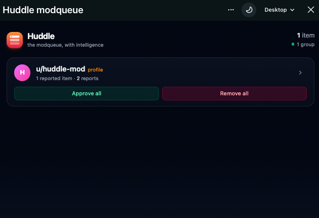
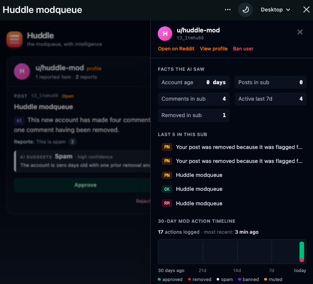

<p align="center">
  
</p>

<h1 align="center">Huddle</h1>

<p align="center"><em>Reports cluster by user. A factual one-sentence summary appears on every queue item. One click reveals the underlying context — without leaving Reddit.</em></p>

Built for the **Reddit Mod Tools and Migrated Apps Hackathon** — submission category: Best New Mod Tool.

---

## The problem

Reddit moderators spend hours each week leaving the modqueue just to gather context: checking user history, scrolling parent threads, scanning prior mod logs. Two peer-reviewed papers quantify this:

- **84% of moderators "sometimes, often, or almost always" leave the modqueue to seek additional context** while reviewing reports.[^1]
- **74.5% of moderators report experiencing a collision** — two mods unknowingly acting on the same item at the same time.[^2]
- The modqueue UI has not been redesigned since 2008.

[^1]: Bajpai, T., & Chandrasekharan, E. (2026). *In the Queue: Understanding How Reddit Moderators Use the Modqueue.* CHI '26. DOI: [10.1145/3772318.3791931](https://dl.acm.org/doi/10.1145/3772318.3791931). Preprint: <https://arxiv.org/abs/2509.07314>

[^2]: Bajpai, T., & Chandrasekharan, E. (2025). *Towards a Better Modqueue: Designing for Diversity Across Moderator Objectives and Workflows.* arxiv:2409.16840. <https://arxiv.org/abs/2409.16840>

## What Huddle does

Huddle is a Devvit app that renders a smarter, team-aware modqueue inside a custom Reddit post.

**1. Automatic grouping.** Reports cluster by the target user, so multiple reports against one bad actor collapse into a single row with bulk **Approve all** / **Remove all** actions.

**2. Factual AI summaries.** Every queue item gets a one-sentence summary in plain English — *"This 4-year-old account has made 2 comments in this subreddit, both within the last 7 days."* The LLM never sees post or comment **content** — only a structured fact dict (account age, prior items in sub, last 7 days, prior removals). When the LLM is unavailable or rate-limited, Huddle silently falls back to a templated raw-facts sentence over the same data, so the UI never breaks.

**3. Context Peek drawer.** Click any item → a right-side drawer shows the exact facts the AI received as a small table, the user's last 5 post/comment titles in this sub with status badges (✓ approved · ✗ removed · ⏳ pending), and a 30-day mod-action mini-timeline. No content is leaked in the drawer; mods who want full content click **Open ↗** to leave Huddle deliberately.

**4. Bulk + inline actions.** Approve / Remove per item, or **Approve all** / **Remove all** at the group level. All actions go through Reddit's API — Huddle never bypasses moderator intent.

## Screenshots

| Grouped queue | Item with AI summary |
|---|---|
|  |  |

| Context Peek drawer | Bulk action |
|---|---|
|  |  |

| Empty state |
|---|
|  |

*(Screenshots live under `docs/screenshots/`. Take them in your dev sub after a few test reports.)*

## Install in your subreddit

You must be a moderator of the target subreddit.

1. Visit the app's page at [developers.reddit.com/apps/huddle-mod](https://developers.reddit.com/apps/huddle-mod).
2. Click **Install** and pick the subreddit.
3. *(Optional)* If you want AI summaries instead of the raw-facts fallback, set your own Gemini key — see "AI summaries" below.
4. In your subreddit, open the subreddit menu (`···`) and click **Install Huddle here**. A custom post titled "Huddle modqueue" is created.
5. Open the post and click **Open queue**. Reports will appear here automatically, clustered by user.

### AI summaries (optional)

Huddle ships with AI summaries powered by [Google Gemini Flash](https://aistudio.google.com/apikey) (free tier — 1,500 requests/day, no card required). The key is configured **once** at the app level and shared across all installs.

To set your own key (if you forked or self-hosted):

```sh
devvit settings set geminiApiKey
```

You'll be prompted to paste the key — it's stored encrypted in Devvit and never echoed back. Summaries are cached forever per item, so a small free-tier quota goes a long way.

If no key is set, Huddle uses a templated raw-facts sentence built from the same fact dict the AI would have received. The moderation utility is identical; only the prose polish is missing.

## Develop locally

Requires Node 22+.

```sh
git clone https://github.com/thamothara7/Huddle.git
cd Huddle
npm install
npm run dev   # devvit playtest in your test subreddit (~huddle_mod_dev)
```

Edit `devvit.json` → `dev.subreddit` to point playtest at your own subreddit (you must be a mod of it).

### Commands

| Command | What it does |
|---|---|
| `npm run dev` | Live playtest — auto-uploads on save and streams logs |
| `npm run build` | Vite build (client + server) |
| `npm run deploy` | type-check → lint → `devvit upload` |
| `npm run launch` | Deploy + publish for App Directory review |
| `npm run type-check` | TypeScript across client/server/shared projects |
| `npm run lint` | ESLint on `src/**/*.{ts,tsx}` |

## Architecture

```
Reddit triggers (PostReport, CommentReport, ModAction, PostSubmit, CommentSubmit)
  → Hono routes at /internal/triggers/*
  → Redis store (ZSETs for groups, JSON-string items, ZSETs for per-user history)
  → React WebView polls /api/init every 5s
  → ItemRow lazy-fetches /api/summary (Gemini + fact-dict, cached forever)
  → Click row → /api/context-peek composes facts + recent titles + 30d action timeline
```

| Folder | Purpose |
|---|---|
| `src/server/routes/triggers.ts` | All 5 trigger handlers |
| `src/server/routes/api.ts` | `/init`, `/summary`, `/context-peek`, `/action`, `/action-bulk` |
| `src/server/core/items.ts`, `groups.ts`, `history.ts`, `reports.ts` | Redis-backed stores |
| `src/server/core/ai/facts.ts` | Per-user facts compute (`getCommentsAndPostsByUser` + `getUserByUsername`) |
| `src/server/core/ai/summary.ts` | Gemini call with cache + raw-facts fallback |
| `src/client/game.tsx` | React queue + Context Peek drawer |
| `src/shared/api.ts` | Types shared between client and server |

## Known limitations

- **Old Reddit users cannot use Huddle.** Custom posts don't render there — this is a Devvit platform constraint.
- **Action timeline starts at install date.** Huddle records mod actions it observes; it cannot backfill the full history of a user.
- **User reports are anonymous.** Reddit's trigger payload does not expose reporter identity for user reports, by policy. Huddle surfaces only the report **reason** — and, when present, mod-initiated reports through a distinct amber "MOD" chip.
- **Single AI provider.** Gemini Flash via Google AI Studio's free tier. Failures of any kind (no key, network, 429, safety block) silently fall back to the raw-facts sentence — Huddle never blocks the UI on the LLM.
- **What Huddle doesn't fix yet.** Bajpai 2025a notes mods still leave the queue to (1) take user-level actions like banning, (2) check Toolbox usernotes, and (3) read full thread context. Huddle closes the "gather context to decide" loop; the user-level-action and Toolbox-integration loops are roadmap items, not v1.

## License

[MIT](LICENSE) © 2026 Thamothara.

Built with [Devvit](https://developers.reddit.com/), [Hono](https://hono.dev/), [React](https://react.dev/), [Vite](https://vite.dev/), [Tailwind CSS](https://tailwindcss.com/), [TypeScript](https://www.typescriptlang.org/), and [Google Gemini](https://ai.google.dev/).
